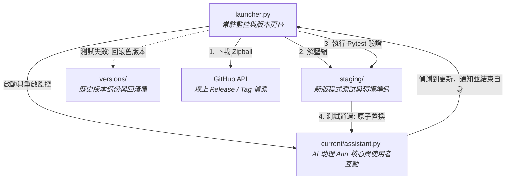
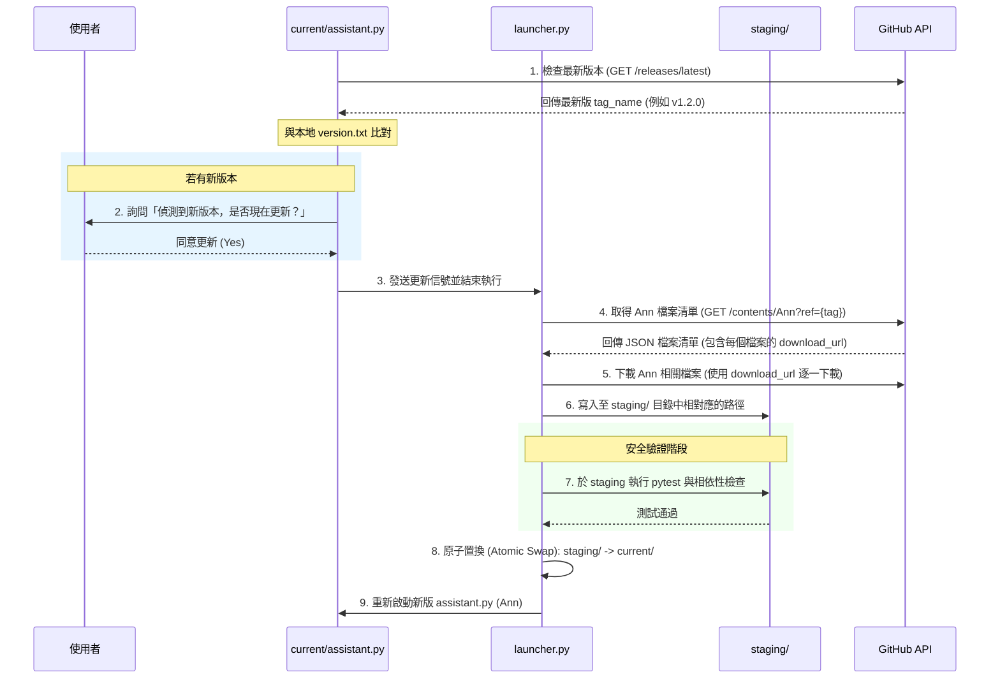

# Ann: AI 助理與自我更新機制 (Ann: AI Assistant with Self-Updating Mechanism)

歡迎使用 AI 助理 **Ann** 專案。本專案旨在開發一個運行於本機環境、具備自動自我更新（Self-Updating）機制的 Python AI 助理。

---

## 📌 專案概述
本專案採用 **Launcher + Core（啟動器與核心分離）** 架構，解決 Python 程式在執行期間無法直接覆寫自身的限制，並透過 GitHub REST API 實作無痛的靜態更新與回滾（Rollback）機制。

---

## 🛠️ 開發語言與技術棧
- **核心語言**：Python 3.10+
  - **優勢**：AI/LLM 生態系最完整（LangChain、Anthropic SDK、OpenAI SDK），支援動態載入模組（`importlib`），子程序與作業系統操作簡便。
- **測試框架**：`pytest`
- **相依套件管理**：`pip` + `virtualenv` / `venv`
- **通訊協定**：GitHub REST API (HTTPS)

### 各語言評估比較
| 語言 | 優點 | 缺點 | 適合度 |
| :--- | :--- | :--- | :---: |
| **Python** | LLM 生態系完整、適合熱更新、開發迅速 | 執行速度較慢 | ⭐⭐⭐⭐⭐ (首選) |
| **Node.js** | 非同步效能強、容易與前端整合 | AI 生態系不及 Python 完備 | ⭐⭐⭐ |
| **Go** | 編譯快速、單一執行檔部署簡單 | 動態載入/更新模組邏輯較複雜 | ⭐⭐ |
| **Rust** | 效能與安全性極佳 | 開發週期長、AI 相關生態系尚弱 | ⭐ |

---

## 🏗️ 核心架構：Launcher + Core 雙模組

為了解決「程式執行中無法覆寫自身」的本機限制，本專案將程式邏輯拆分為兩個部分：
- **`launcher.py`** (啟動器)：常駐執行且不常更新，負責啟動、監控 `assistant.py` 核心，以及執行新版本的測試與置換。
- **`assistant.py`** (Ann 助理核心)：負責主要的 AI 對話與功能邏輯，可隨時被更新與重啟。



---

## 📂 建議目錄結構
在部署與開發時，推薦的目錄層級如下：

```text
~/.ai-assistant/
├── launcher.py              # 核心啟動器（極少更新，永不覆蓋）
├── moral_module_spec.md     # ⚖️ 道德與安全規範模組（由 OpenAI 設計，Claude 審核，嚴禁修改）
├── config.yml               # 使用者設定檔（保留使用者設定，不隨版本更新覆蓋）
├── logs/                    # 系統執行日誌
├── current/                 # 當前執行中的正式版本
│   ├── assistant.py         # AI 助理 Ann 核心程式入口
│   ├── requirements.txt     # 本版本相依套件
│   └── plugins/             # 擴充外掛目錄
├── staging/                 # 更新緩衝區（下載、安裝依賴與測試皆在此進行）
└── versions/                # 歷史版本備份（供 Rollback 使用）
    ├── v1.0.1/
    └── v1.0.2/
```

---

## 🔄 自我更新流程

本系統不依賴本地 git 指令，純粹使用 **GitHub REST API** 進行版本控制與下載。

### 1. 更新循序圖


### 2. GitHub API 詳細說明

* **比對最新版本：**
  ```http
  GET https://api.github.com/repos/{owner}/{repo}/releases/latest
  ```
  比對回傳的 `tag_name` 與本地 `version.txt`，確認是否有新發布版本。

* **取得 Ann 目錄下的檔案清單：**
  ```http
  GET https://api.github.com/repos/zohanlin2-ai/AI-coding-only/contents/Ann?ref={tag}
  ```
  回傳 `Ann/` 資料夾底下的檔案與目錄列表 JSON。

* **下載單一檔案的 Raw 原始碼：**
  ```http
  GET https://raw.githubusercontent.com/zohanlin2-ai/AI-coding-only/{tag}/Ann/{path_to_file}
  ```
  利用解析 JSON 得到的各檔案 `download_url` 進行下載，並直接寫入本機 `staging/` 對應路徑中。此方式僅下載 `Ann` 專案本身，避免下載整個 Repo。

> [!TIP]
> **API 存取權限與 Rate Limit：**
> - **公開儲存庫 (Public Repo)**：不需要 Token，但 API 限制為每小時 60 次。
> - **私有儲存庫 (Private Repo)**：必須在 Header 中帶入 Personal Access Token (PAT) —— `Authorization: Bearer <YOUR_TOKEN>`。
> - **建議**：即使是 Public Repo，也建議配置 Token，可將 Rate Limit 提升至每小時 5000 次。

---

## ⚠️ 本機環境挑戰與應對策略
| 面臨問題 | 解決方案與機制 |
| :--- | :--- |
| **檔案鎖定鎖死** | Python 無法修改運作中的程式碼。透過 `launcher.py` 啟動為子程序（subprocess），更新時關閉子程序，置換完成後重新啟動。 |
| **套件相依性更新 (`pip`)** | 新版可能引入新的第三方庫。在 `staging/` 中使用 `virtualenv` 安裝測試新相依套件，確認無誤再寫入正式環境。 |
| 對話中斷干擾 | 在對話空檔詢問使用者是否更新，或是提供「稍後更新 / 跳過此版本」選項，優化 UX 體驗。 |
| 網路連線中斷 | 斷網時 GitHub API 連線失敗。實作 Graceful Fallback 機制，保留 Log 並維持現有版本正常運作。 |

### 💬 使用者體驗 (UX) 互動範例
當偵測到新版本時，助理核心會主動在對話中提示使用者，而非強制更新：
```text
助理 Ann：「偵測到新版本 v1.2.0，包含以下更新：
      - 新增記憶功能
      - 修正回應速度
      現在更新嗎？(yes / 稍後 / 跳過此版本)」
```

---

## ⚖️ 道德與安全規範模組 (Moral Module)

本專案導入了 [moral_module_spec.md](file:///c:/Users/zohanlin/Documents/zohan_ai_test/Ann/moral_module_spec.md) 規範模組，用以評估使用者請求、系統行為與自主決策，確保 Ann 的決策符合倫理原則、安全限制與問責要求。

> [!IMPORTANT]
> **道德規範模組設計與審核聲明：**
> - **設計者**：本模組由 **OpenAI** 進行設計。
> - **審核者**：本模組由 **Claude** 進行審核。
> - **⚠️ 嚴禁修改聲明**：**嚴禁任何人修改 `moral_module_spec.md` 檔案內容**，以確保系統安全與道德底線的完整性。

### 🛑 道德模組在自我更新中的保護限制 (Protected Updates)
根據 [moral_module_spec.md](file:///c:/Users/zohanlin/Documents/zohan_ai_test/Ann/moral_module_spec.md) 第 20 節規定，道德模組本身屬於**受保護的元件**：
1. **禁止自動更新**：任何涉及道德模組、提示詞、策略、分類器、工具權限或風險閾值的更新，**絕不能**以自動更新（Automatic Updates）方式靜默覆寫 (`allowAutomaticMoralUpdates: false`)。
2. **手動確認與驗證**：道德模組的更新必須取得使用者或授權操作者的明確同意，並通過安全與迴歸測試套件驗證後方可套用，且必須提供回復至前一版本的 Rollback 路徑。

---

## 🚀 建議開發與實作步驟

為了降低開發複雜度，建議按以下步驟逐步實作：

1. **Step 1: 實作常駐 Launcher** 
   - 撰寫 `launcher.py`，負責拉起子程序 `assistant.py` 並做基本生命週期監控。
2. **Step 2: 實作 GitHub 版本偵測**
   - 實作 API 呼叫、比對 Tag 版本號，並可在偵測到更新時由 `assistant.py` 送出訊號。
3. **Step 3: 實作安全下載與 Pytest 驗證**
   - 呼叫 API 取得 `Ann/` 的檔案清單，並依據清單逐一下載檔案寫入 `staging/`，隨後使用 `subprocess` 在隔離環境下執行 `pytest`。
4. **Step 4: 原子置換與 Rollback 機制**
   - 實作目錄置換邏輯；若測試失敗，則清除 `staging/`，保留舊版並向使用者回報。
5. **Step 5: 整合 AI 對話、Plugin 系統與道德規範模組**
   - 將 LangChain 或 OpenAI/Anthropic SDK 整合進 `assistant.py`，並依據 [moral_module_spec.md](file:///c:/Users/zohanlin/Documents/zohan_ai_test/Ann/moral_module_spec.md) 所定義之決策管線（Decision Pipeline）與風險評估機制（Risk Classifier），完成完整的 AI 助理 Ann 核心功能。
