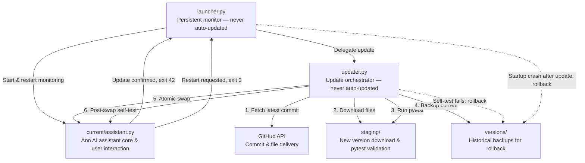
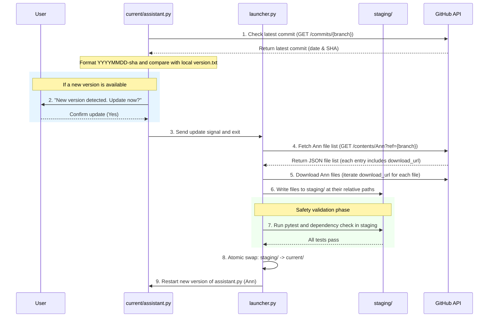

# Ann: AI Assistant with Self-Updating Mechanism

Welcome to the **Ann** AI assistant project. Ann is a locally-hosted Python AI assistant featuring an automatic self-updating mechanism.

---

## 📌 Project Overview

This project adopts a **Launcher + Core (separated processes)** architecture to overcome the limitation that a Python process cannot overwrite its own running files. Version management and file delivery are handled entirely through the GitHub REST API, enabling painless updates and rollbacks.

---

## 🛠️ Development Language & Tech Stack

- **Core Language**: Python 3.10+
  - **Advantages**: The richest AI/LLM ecosystem (LangChain, Anthropic SDK, OpenAI SDK), easy dynamic module loading (`importlib`), simple subprocess and OS operations.
- **Test Framework**: `pytest`
- **Dependency Management**: `pip` + `virtualenv` / `venv`
- **Communication Protocol**: GitHub REST API (HTTPS)

### Language Comparison

| Language | Pros | Cons | Suitability |
| :--- | :--- | :--- | :---: |
| **Python** | Complete LLM ecosystem, hot-update friendly, rapid development | Slower execution speed | ⭐⭐⭐⭐⭐ (Recommended) |
| **Node.js** | Strong async performance, easy front-end integration | AI ecosystem less mature than Python | ⭐⭐⭐ |
| **Go** | Fast compilation, simple single-binary deployment | Complex dynamic module loading/updating logic | ⭐⭐ |
| **Rust** | Excellent performance and safety | Longer development cycle, weak AI ecosystem | ⭐ |

---

## 🏗️ Core Architecture: Launcher + Core Dual-Module

To solve the "cannot overwrite running code" local limitation, the project splits program logic into two components:

- **`launcher.py`** (Launcher): Always running, rarely updated. Responsible for starting and monitoring the `assistant.py` core, and executing test-and-swap for new versions.
- **`assistant.py`** (Ann Assistant Core): Thin CLI entry point. Handles startup, system commands (exit/restart/update), and delegates conversation to `CoreController`.
- **`core_controller.py`** (CoreController): Unified business logic layer shared by CLI and GUI. Runs the full conversation pipeline: moral evaluation → memory → intent routing → Ollama fallback.
- **`intent_router.py`** (IntentRouter): Plugin registry. Registers `BaseIntentParser` modules (alarm, file, news, …) and routes each user message to the first matching module via `should_parse() → parse_intent() → execute()`.
- **`assistant_gui.py`** (Ann GUI): Thin PyQt6 presentation layer. Uses `ControllerWorker(QThread)` to run `CoreController.post_message()` in the background, keeping the UI fully responsive.




## 🧩 Adding a New Module — Rules & Guidelines

Ann uses an **IntentRouter + BaseIntentParser** plugin architecture. Each feature module is an independent class that can be mounted without modifying any existing business logic, as long as it follows the contract below.

---

### 1. Plugin Contract

All feature modules **must** extend `BaseIntentParser` and implement the following 5 methods:

```python
from base_intent_parser import BaseIntentParser, ModuleResult

class MyModule(BaseIntentParser):
    # Required: keyword list (fast pre-filter, no Ollama call)────
    KEYWORDS = ["my_keyword", "my_feature"]

    # Required: system prompt for Ollama (defines JSON schema)──
    def _build_system_prompt(self) -> str:
        return "Your system prompt here..."

    # Required: validate and normalize the JSON returned by Ollama────
    def _validate_and_normalize(self, result: dict) -> dict:
        # Ensure intent is one of the allowed values
        if result.get("intent") not in {"do_something", "none"}:
            result["intent"] = "none"
        return result

    # Required: empty result returned when intent does not match────────
    def _empty_result(self) -> dict:
        return {"intent": "none", "param": None}

    # Required: regex fallback when Ollama is offline or JSON parsing fails──
    def _regex_fallback(self, text: str) -> dict:
        if "my_keyword" in text.lower():
            return {"intent": "do_something", "param": text}
        return self._empty_result()

    # Required: module business logic, returns a ModuleResult────────
    def execute(self, parsed: dict, context: dict) -> ModuleResult:
        reply = f"Handled: {parsed.get('param', '')}"
        return ModuleResult(reply=reply)
```

> [!IMPORTANT]
> `execute()` is called inside a **background thread (ControllerWorker)**. Blocking I/O (network requests, file reads, Ollama calls) is allowed. **Do not** directly manipulate any Qt object (Widget, QLabel, QTimer, etc.) inside `execute()`.

---

### 2. `context` Dictionary API

`execute()`'s second argument `context` is provided by `CoreController.post_message()` and contains the following guaranteed keys:

| Key | Type | Description |
|:----|:-----|:------------|
| `config` | `dict` | Full `config.yml` settings |
| `conversation` | `list[dict]` | Current conversation history (`[{"role": "user"/"assistant", "content": "..."}]`) |
| `base_dir` | `Path` | Ann root directory (for reading/writing persistent data) |
| `user_text` | `str` | The user's original input text |
| `call_llm` | `Callable[[str], str]` | Synchronous function to call Ollama directly, accepts a single prompt string |
| `alarm_manager` | `AlarmManager \| None` | Alarm manager instance |
| `news_manager` | `NewsManager \| None` | News manager instance |
| `controller` | `CoreController` | The `CoreController` instance itself (needed by plugins that must mutate shared state, e.g. model switching) |

> [!NOTE]
> If your module needs its own initialized object (e.g. a database connection or API client), initialize it in the module's `__init__` and store it as `self.xxx`. **Do not** pass it through `context` — `context` only provides globally shared resources.

---

### 3. Notes on Using `conversation`

- `conversation` is a **shared mutable list used by all modules**.
- **Do not directly `append`** to `conversation` inside `execute()` — `CoreController` automatically handles conversation logging after routing succeeds.
- If your module calls `call_llm()` and wants the exchange to appear in the conversation history, let `CoreController`'s standard flow handle it after `execute()` returns (do not manually append inside `execute()`).

---

### 4. `ModuleResult` Field Descriptions

```python
@dataclass
class ModuleResult:
    reply: str                      # Required: text to display to the user
    data: dict = {}                 # Optional: generic payload dict; e.g. {"articles": [...]} for news cards
    marker: str | None = None       # Optional: control marker e.g. '[EXIT]', '[RESTART]'
```

> [!WARNING]
> The `marker` field is reserved only for system-level control flows (exit, restart, update). **General feature modules must not set `marker`.**

---

### 5. Naming & File Location Rules

| Item | Requirement |
|:-----|:------------|
| **Module directory** | For complex features, create `current/<your_module>/`; single-file features can be placed directly as `current/<your_module>_handler.py` |
| **IntentParser class name** | Must end with `IntentParser`, e.g. `TodoIntentParser` |
| **KEYWORDS** | Use a mix of English terms to cover likely user inputs |
| **`_build_system_prompt()`** | Must explicitly instruct Ollama to return only JSON and include the field schema |
| **Test file** | Must create a corresponding unit test at `current/tests/test_<your_module>.py` |

---

### 6. Registering a Module

After creating the module, register it in `CoreController.setup_modules()`:

```python
# current/core_controller.py → CoreController.setup_modules()
def setup_modules(self) -> None:
    # ... existing modules ...

    from my_module import MyModule  # Replace with your module
    my_module = MyModule(self.llm_base_url, self.llm_model)
    self.router.register(my_module)
```

> [!IMPORTANT]
> **The router is ordered (first-match-wins)**. The order of `register()` calls determines priority: modules registered first are tried first. Place **more specific** modules before **more general** ones to avoid over-interception.

---

### 7. Prohibited Patterns

| ❌ Prohibited | ✅ Do Instead |
|:--------|:---------|
| Manipulate Qt Widgets inside `execute()` | Return text via `ModuleResult.reply`; let the GUI render it |
| Access `assistant_gui.py` directly from a module | Retrieve needed data via `context` |
| `append` to `context["conversation"]` inside `execute()` | Let `CoreController` record it automatically after routing |
| Implement exit / restart / update system commands inside a module | System commands are handled only in the main loop of `assistant.py` / `assistant_gui.py` |
| Call Ollama inside `should_parse()` | `should_parse()` must be a pure keyword check — no I/O allowed |

---

### 8. Quick Example: Adding a TodoModule

**Step 1 — Create `current/todo_handler.py`**

```python
from base_intent_parser import BaseIntentParser, ModuleResult

class TodoIntentParser(BaseIntentParser):
    KEYWORDS = ["todo", "task", "remind me"]

    def _build_system_prompt(self) -> str:
        return (
            "Extract todo intent from the user message.\n"
            "Respond ONLY with valid JSON: "
            '{"intent": "add_todo | list_todo | none", "content": "string or null"}'
        )

    def _validate_and_normalize(self, result: dict) -> dict:
        if result.get("intent") not in {"add_todo", "list_todo", "none"}:
            result["intent"] = "none"
        return result

    def _empty_result(self) -> dict:
        return {"intent": "none", "content": None}

    def _regex_fallback(self, text: str) -> dict:
        if "todo" in text.lower() or "task" in text.lower():
            return {"intent": "add_todo", "content": text}
        return self._empty_result()

    def execute(self, parsed: dict, context: dict) -> ModuleResult:
        base_dir = context["base_dir"]
        todo_file = base_dir / "todos.txt"

        if parsed["intent"] == "add_todo":
            content = parsed.get("content") or context["user_text"]
            with open(todo_file, "a", encoding="utf-8") as f:
                f.write(f"- {content}\n")
            return ModuleResult(reply=f"Added todo: {content}")

        if parsed["intent"] == "list_todo":
            if todo_file.exists():
                items = todo_file.read_text(encoding="utf-8").strip()
                return ModuleResult(reply=f"Todo list:\n{items}" if items else "No todos yet.")
            return ModuleResult(reply="No todos yet.")

        return ModuleResult(reply="")
```

**Step 2 — Register in `CoreController.setup_modules()`**

```python
from todo_handler import TodoIntentParser
todo_parser = TodoIntentParser(self.llm_base_url, self.llm_model)
self.router.register(todo_parser)
```

**Step 3 — Add unit tests in `tests/test_todo.py`. Done.**

---

## ⚙️ Installation & Usage

### 1. Prerequisites
- **Python**: Version 3.10 or higher.
- **Ollama**: Local LLM server running on your machine.
  - Install Ollama from [ollama.com](https://ollama.com).
  - Pull and run the default model specified in [config.yml](file:///c:/Users/zohanlin/Documents/zohan_ai_test/Ann/config.yml) (typically `gemma4:e4b`):
    ```bash
    ollama run gemma4:e4b
    ```

### 2. Dependency Installation
Install the required packages from the dependency manifest:
```bash
pip install -r current/requirements.txt
```
This installs `PyQt6` (for GUI), `pygame` (for audio alarms), `requests` and `httpx` (for the Ollama HTTP API and other HTTP calls), `pyyaml` (for configuration parsing), `filelock` (for concurrent memory persistence), `pytest` (for unit testing), and all news module dependencies (`feedparser`, `newspaper3k`, `readability-lxml`, `beautifulsoup4`, and `googlenewsdecoder`). Ann talks to Ollama directly over HTTP, so the standalone `ollama` Python package is not required.

### 3. Running Ann
You can run Ann in two modes. The launcher automatically monitors and updates the core:
- **GUI Mode (Default)**:
  ```bash
  python launcher.py
  ```
  Launches a floating bubble avatar. Click to expand into a full dark-mode chat window, drag to reposition, and click the dismiss button or the bubble itself to shut off active alarms.

- **CLI Mode (Terminal)**:
  ```bash
  python launcher.py --cli
  ```
  Runs as a conversational shell in the terminal. If an alarm triggers, it prints reminder alerts every 2 seconds and can be dismissed by pressing Enter.

### ⏰ Alarm Module
Ann supports conversational alarm management (create, delete, list) through natural conversation. You can set relative/absolute alarms, check active alarms, and cancel them.
For complete architectural details, audio loop specs, and UI animations, see [alarm_module_spec.md](./alarm_module_spec.md).

### 📂 Drag & Drop Module
Ann supports dragging and dropping plain text and image files onto the floating bubble or the chat window. Dropped files are attached to the conversation context and can be clicked to display a popup preview (viewing full text or images).
For detailed interaction specifications, see [drag_drop_spec.md](./drag_drop_spec.md).

### 🤖 AI Engine Module
Ann encapsulates all communication with the local Ollama API into a modular `OllamaClient` component within the AI Engine. It automatically detects installed models and their capabilities (such as vision support). When an image is attached, it dynamically routes the request to a local vision-capable model (like `llava`) or guides the user if none is installed.
For technical details, see [ai_engine_spec.md](./ai_engine_spec.md).

### 📝 File Generation & Export Module
Ann supports exporting and saving AI-generated code blocks and documentation directly to the local filesystem:
- **UI-Based Saving**: Code blocks in the chat GUI are rendered with a custom code container displaying a language badge and a "Save File" button, allowing quick, secure, and filtered saving for `.py`, `.c`, `.cpp`, `.java`, `.sh`, `.html`, `.xml`, `.css`, `.js`, `.ts`, `.sql`, `.toml`, `.env`, `.md`, and `.txt` files.
- **Conversational Saving (Option C)**: You can request file generation directly in the dialogue (e.g., "Save the previous code as app.py" or "Export the conversation history to history.md"). Ann will parse the intent locally and save the file directly to the workspace directory.

For complete specs, see [file_generation_spec.md](./file_generation_spec.md).

### 📰 News Module
Ann supports conversational news queries using local Ollama model to parse search intents, retrieve and parse RSS feeds (e.g. Google News, Reuters), filter articles by keywords/categories, and generate concise article summarizations (3–5 sentences) upon request.
For full specifications, caching policies, and architecture, see [news_module_spec.md](./news_module_spec.md).

### 🧠 Memory Module
Ann integrates a local conversational memory system designed in [AI_Memory_System_Design_v2.md](./AI_Memory_System_Design_v2.md) to persist user context across CLI and GUI sessions:
- **Two-Phase Background Extraction**: Facts stated by the user are extracted on input (Phase 1), and commitments/conclusions are extracted after response generation (Phase 2) using separate background threads.
- **Concurrent Safe Persistence**: Stored under `memory/` directory via daily JSON file slices and managed registry index with strict `filelock` synchronization.
- **Semantic Retrieval with Keyword Fallback**: When the active Ollama model supports embeddings, retrieval blends cosine similarity (50%), keyword overlap (25%), and recency/confidence (25%) to find the most semantically relevant memories. Falls back to keyword-only scoring when embeddings are unavailable.
- **Conflict Detection**: When a new memory is added, a background thread checks for direct contradictions with existing same-category memories and automatically marks conflicting entries as `outdated`.
- **Auto Organization**: Every 20 active memories, similar memory clusters are automatically merged into a single consolidated entry by the LLM, keeping the memory store concise.
- **Commands Control**: Full user override control using `/memory` slash commands:
  - `/memory list` — Lists all currently remembered active context.
  - `/memory add <content>` — Manually registers a new context fact.
  - `/memory edit <id> <new_content>` — Modifies a specific memory by its ID.
  - `/memory delete <id>` — Discards a specific context memory.
  - `/memory stats` — Shows active/total/deleted counts, file count, and storage size.
  - `/memory ui` — Opens the visual memory management dialog (GUI mode only).
  - `/memory off` / `/memory on` — Globally pauses/resumes the memory layer.

### 🛡️ Security Mode
Ann supports a conversational security monitoring mode backed by the `realtime-security-daemon` design:
- **Conversation-Triggered Switch**: Say "enable security mode" to enter, or "exit security mode" to leave. The switch is handled by `SecurityIntentParser` — no additional GUI controls needed.
- **Bubble Visual Feedback**: The floating bubble switches to a dual-ring red pulse effect (outer faint halo + inner breathing ring) while security mode is active. The inner circle colour is unchanged.
- **Security Dashboard**: The chat content area switches to a compact dashboard showing Daemon status, Queue depth, and a scrollable alert feed with severity colour coding and click-to-expand details including MITRE ATT&CK mapping and response recommendations.
- **Persistent Input Bar**: The conversation input bar remains available in security mode so you can continue asking questions.
- **Update Lock**: For system safety and operational integrity, program updates cannot be checked or performed while security monitoring mode is active.
- **Status Queries**: Ask "how many alerts are there" / "daemon status" for a plain-text status summary without entering full dashboard mode.
- Phase 1 uses mock data; Phase 2 will read from the real security daemon's `alerts.jsonl` / SQLite store.
For details, see the [Daemon Architecture Guide](./realtime-security-daemon/nist-csf-mitre-attack-realtime-daemon-guide-enhanced.md), [Dashboard UI Spec](./realtime-security-daemon/nist-csf-mitre-attack-realtime-ui-spec.md), and [Network Packet Monitor UI Spec](./realtime-security-daemon/network-packet-monitor-ui-spec.md) in the [`realtime-security-daemon/`](./realtime-security-daemon/) directory.

### 🤖 Model Management Module
Ann supports querying and switching the active Ollama model through natural conversation:
- **Query current model**: Ask "what model are you using?" to see the active model.
- **List available models**: Ask "what models are available?" to list all installed Ollama models with the active one highlighted.
- **Switch model**: Say "switch to llama3" to change models immediately. The switch takes effect in-session for all modules and is persisted to `config.yml` for future sessions. Fuzzy matching resolves partial names when unambiguous.

### 🔄 Conversational System Commands
Ann supports executing system actions directly through natural conversation, featuring warm LLM response generation prior to execution:
- **Exit Program**: Commands like "goodbye", "close the window", "exit", "close the app" trigger a warm goodbye, append `[EXIT]`, disable inputs, and shut down after a 1.5 seconds delay.
- **Restart Program**: Commands like "restart", "reboot" trigger a warm "see you later" reply, append `[RESTART]`, and relaunch the assistant immediately.
- **Update Program**: Commands like "update", "upgrade" trigger an update check. Upon confirmation, Ann replies with a warm goodbye, appends `[UPDATE]`, and runs the self-updater.

---

## 📂 Recommended Directory Structure

The recommended layout for deployment and development:

```text
~/.ai-assistant/
├── launcher.py              # Core launcher (rarely updated, never overwritten)
├── updater.py               # Update orchestrator (rarely updated, never overwritten)
├── moral_module_spec.md     # ⚖️ Moral & safety specification (DO NOT MODIFY)
├── config.yml               # User configuration (preserved across updates)
├── config/                  # Configuration directory
│   └── news_sources.yml     # RSS news sources definitions
├── version.txt              # Current version string (managed by updater)
├── logs/                    # System logs
├── memory/                  # AI memory persistence directory (preserved across updates)
│   ├── index.json           # Memory registry index tracking metadata
│   └── memories/            # Date-sliced daily memory files YYYY-MM-DD_memory.json
├── current/                 # Active production version (auto-updated)
│   ├── assistant.py         # Ann AI assistant — CLI entry point
│   ├── assistant_gui.py     # Ann AI assistant — GUI (PyQt6/PySide6)
│   ├── alarm_handler.py     # Shared alarm intent dispatch (CLI + GUI)
│   ├── memory_manager.py    # AI Memory System core logic and thread manager
│   ├── memory_dialog.py     # Memory management UI dialog (QDialog, GUI only)
│   ├── ollama_client.py     # Unified Ollama API client with vision routing
│   ├── file_handler.py      # File generation & export intent handler
│   ├── moral_evaluator.py   # Moral/safety risk classifier
│   ├── security_plugin.py   # Security mode intent parser plugin
│   ├── model_handler.py     # Model query & switching intent parser plugin
│   ├── security_dashboard.py# Security Dashboard widget (QStackedWidget view)
│   ├── version_check.py     # GitHub API version check helper
│   ├── alarms/              # Alarm storage and scheduler
│   ├── news/                # News parsing, fetching, extracting, and summarization
│   ├── plugins/             # Plugin extension directory
│   ├── requirements.txt     # Dependencies for this version
│   └── tests/               # Unit tests (run in staging before each update)
│       └── test_memory.py   # AI Memory System unit tests
├── staging/                 # Update buffer (download, test, then swap here)
└── versions/                # Historical version backups (for rollback)
    ├── v20260101-abc1234/
    └── v20260201-def5678/
```

---

## 🔄 Self-Updating Flow

This system requires **no local git commands** — it relies entirely on the **GitHub REST API** for version control and file delivery.

> [!IMPORTANT]
> **Strict Design Rule**: The update mechanism MUST use the GitHub REST API (HTTP) for all version checking, file listings, and downloads. Using local `git` commands (such as `git pull` or `git fetch`) within the update flow is strictly prohibited to ensure Ann can self-update even when deployed in non-Git target environments.


### 1. Update Sequence Diagram



### 2. GitHub API Details

* **Check latest branch commit:**
  ```http
  GET https://api.github.com/repos/{owner}/{repo}/commits/{branch}
  ```
  Extract `commit.committer.date` (formatted as `YYYYMMDD`) and `sha` (first 7 characters) and combine them into `YYYYMMDD-sha`. Compare this formatted string with the local `version.txt` to determine whether an update is needed.

* **Fetch file list for the Ann directory:**
  ```http
  GET https://api.github.com/repos/zohanlin2-ai/AI-coding-only/contents/Ann?ref={branch}
  ```
  Returns a JSON list of files and subdirectories under `Ann/`.

* **Download a single file (raw content):**
  ```http
  GET https://raw.githubusercontent.com/zohanlin2-ai/AI-coding-only/{branch}/Ann/{path_to_file}
  ```
  Each file's `download_url` from the JSON list is used to download the file directly into the corresponding path under `staging/`. This approach downloads **only the `Ann` project** — not the entire repository.

> [!TIP]
> **API Access & Rate Limits:**
> - **Public Repo**: No token required, but limited to 60 requests/hour.
> - **Private Repo**: Must include a Personal Access Token (PAT) in the header — `Authorization: Bearer <YOUR_TOKEN>`.
> - **Recommendation**: Even for public repos, configuring a token raises the limit to 5,000 requests/hour.


---

## ⚠️ Local Environment Challenges & Solutions

| Challenge | Solution |
| :--- | :--- |
| **File lock / in-use** | Python cannot modify its own running code. `launcher.py` spawns `assistant.py` as a subprocess; during update, the child process is terminated, files are swapped, and it is restarted. |
| **Dependency updates (`pip`)** | New versions may introduce new third-party packages. `virtualenv` isolation in `staging/` validates new dependencies before writing to the production environment. |
| **Interrupting active conversation** | The update prompt is shown at conversation breaks. The user may choose "later" or "skip this version" to avoid unwanted interruptions. |
| **Network unavailable** | GitHub API calls fail when offline. A graceful fallback keeps the existing version running and records the failure in the log. |

### 💬 UX Interaction Example

When a new version is detected, the assistant proactively prompts the user rather than forcing an update:

```text
Ann: "New version v1.2.0 is available. It includes:
      - Added memory feature
      - Improved response speed
      Update now? (yes / later / skip this version)"
```

---

## ⚖️ Moral & Safety Specification Module

This project integrates [moral_module_spec.md](./moral_module_spec.md) to evaluate user requests, system actions, and autonomous decisions, ensuring Ann's behavior aligns with ethical principles, safety constraints, and accountability requirements.

> [!IMPORTANT]
> **Moral Module Authorship & Audit Declaration:**
> - **Designed by**: **OpenAI**
> - **Audited by**: **Claude**
> - **⚠️ Modification strictly prohibited**: **No one is permitted to modify `moral_module_spec.md`.** The integrity of Ann's moral baseline depends on this file remaining unchanged.

### 🛑 Protected Updates in the Self-Updating Mechanism

Per [moral_module_spec.md](./moral_module_spec.md) §20, the moral module is a **protected component**:

1. **No automatic updates**: Any change to the moral module, its prompts, policies, classifiers, tool permissions, or risk thresholds **must never** be applied silently via the auto-update mechanism (`allowAutomaticMoralUpdates: false`).
2. **Explicit confirmation required**: Updates to the moral module require explicit approval from the user or an authorized operator, must pass a safety and regression test suite, and must provide a rollback path to the previous version.

### ⚠️ Current Implementation Status & Limitations

- **Rule-Based Engine**: The moral evaluator currently uses a deterministic regex rules engine for risk classification. It does not yet employ a hybrid/semantic LLM classifier.
- **Risk of Over-Refusal (False Positives)**: Due to the keyword/regex nature, benign or fictional requests containing sensitive terms (e.g., educational or creative writing requests) may trigger unnecessary refusals or safeguards.
- **Simplified Interface**: The current implementation handles basic risk assessment and output decisions but does not yet support the full Section 26 data structure, audit log generation, or E1–E5 local escalation confirmation dialogs.

---

## 🤖 AI Coding Guidelines (CLAUDE.md)

> [!IMPORTANT]
> All contributors — including AI coding assistants — **must read and follow [CLAUDE.md](./CLAUDE.md) before making any code changes.**
>
> Key principles:
> - **Think before coding**: state assumptions, surface tradeoffs, ask when uncertain.
> - **Simplicity first**: minimum code that solves the problem; no speculative features.
> - **Surgical changes**: touch only what is necessary; match existing style.
> - **Goal-driven**: define verifiable success criteria before starting.

---

## 🚀 Development Roadmap

To minimize complexity, implement the project in the following order:

1. **Step 1: Persistent Launcher**
   - Implement `launcher.py` to spawn `assistant.py` as a subprocess and monitor its lifecycle.
2. **Step 2: GitHub Version Detection**
   - Implement the API call, compare tag versions, and signal the launcher when an update is available.
3. **Step 3: Secure Download & pytest Validation**
   - Fetch the `Ann/` file list via the Contents API, download each file into `staging/`, then run `pytest` in an isolated environment using `subprocess`.
4. **Step 4: Atomic Swap & Rollback**
   - Implement directory swap logic; on test failure, clear `staging/`, retain the current version, and notify the user.
5. **Step 5: AI Dialogue, Plugin System & Moral Module Integration**
   - Integrate an LLM SDK (e.g. Ollama, LangChain, or Anthropic/OpenAI SDK) into `assistant.py`, and wire up the decision pipeline and risk classifier defined in [moral_module_spec.md](./moral_module_spec.md) to complete Ann's full core functionality.
