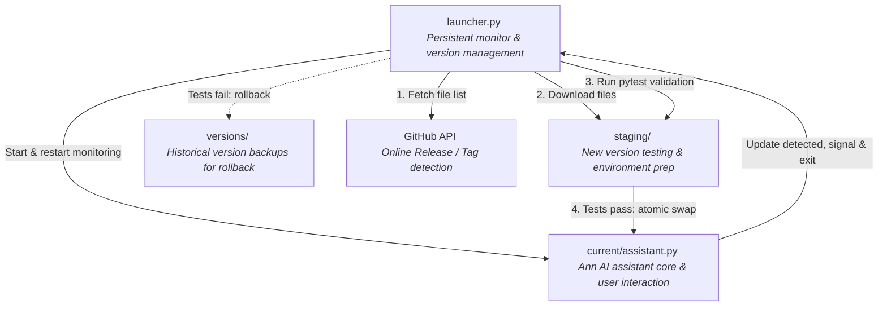
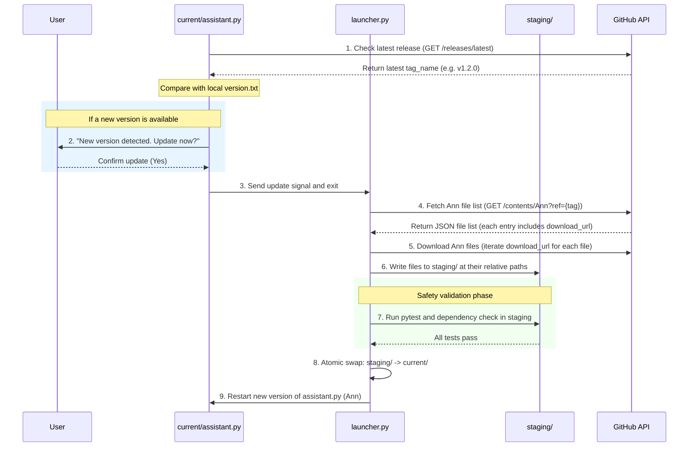

# Ann: AI Assistant with Self-Updating Mechanism

Welcome to the **Ann** AI assistant project. Ann is a locally-hosted Python AI assistant featuring an automatic self-updating mechanism.

---

## 📌 Project Overview

This project adopts a **Launcher + Core (separated processes)** architecture to overcome the limitation that a Python process cannot overwrite its own running files. Version management and file delivery are handled entirely through the GitHub REST API, enabling painless updates and rollbacks.

---

## 🛠️ Development Language & Tech Stack

- **Core Language**: Python 3.10+
  - **Advantages**: The richest AI/LLM ecosystem (LangChain, Anthropic SDK, OpenAI SDK), easy dynamic module loading (`importlib`), simple subprocess and OS operations.
- **Test Framework**: `pytest`
- **Dependency Management**: `pip` + `virtualenv` / `venv`
- **Communication Protocol**: GitHub REST API (HTTPS)

### Language Comparison

| Language | Pros | Cons | Suitability |
| :--- | :--- | :--- | :---: |
| **Python** | Complete LLM ecosystem, hot-update friendly, rapid development | Slower execution speed | ⭐⭐⭐⭐⭐ (Recommended) |
| **Node.js** | Strong async performance, easy front-end integration | AI ecosystem less mature than Python | ⭐⭐⭐ |
| **Go** | Fast compilation, simple single-binary deployment | Complex dynamic module loading/updating logic | ⭐⭐ |
| **Rust** | Excellent performance and safety | Longer development cycle, weak AI ecosystem | ⭐ |

---

## 🏗️ Core Architecture: Launcher + Core Dual-Module

To solve the "cannot overwrite running code" local limitation, the project splits program logic into two components:

- **`launcher.py`** (Launcher): Always running, rarely updated. Responsible for starting and monitoring the `assistant.py` core, and executing test-and-swap for new versions.
- **`assistant.py`** (Ann Assistant Core): Handles all AI conversation and feature logic. Can be updated and restarted at any time.



---

## 📂 Recommended Directory Structure

The recommended layout for deployment and development:

```text
~/.ai-assistant/
├── launcher.py              # Core launcher (rarely updated, never overwritten)
├── moral_module_spec.md     # ⚖️ Moral & safety specification (designed by OpenAI, audited by Claude — DO NOT MODIFY)
├── config.yml               # User configuration (preserved across updates)
├── logs/                    # System logs
├── current/                 # Active production version
│   ├── assistant.py         # Ann AI assistant core entry point
│   ├── requirements.txt     # Dependencies for this version
│   └── plugins/             # Plugin extension directory
├── staging/                 # Update buffer (download, install deps, and test here)
└── versions/                # Historical version backups (for rollback)
    ├── v1.0.1/
    └── v1.0.2/
```

---

## 🔄 Self-Updating Flow

This system requires **no local git commands** — it relies entirely on the **GitHub REST API** for version control and file delivery.

### 1. Update Sequence Diagram



### 2. GitHub API Details

* **Check latest release:**
  ```http
  GET https://api.github.com/repos/{owner}/{repo}/releases/latest
  ```
  Compare the returned `tag_name` with the local `version.txt` to determine whether an update is needed.

* **Fetch file list for the Ann directory:**
  ```http
  GET https://api.github.com/repos/zohanlin2-ai/AI-coding-only/contents/Ann?ref={tag}
  ```
  Returns a JSON list of files and subdirectories under `Ann/`.

* **Download a single file (raw content):**
  ```http
  GET https://raw.githubusercontent.com/zohanlin2-ai/AI-coding-only/{tag}/Ann/{path_to_file}
  ```
  Each file's `download_url` from the JSON list is used to download the file directly into the corresponding path under `staging/`. This approach downloads **only the `Ann` project** — not the entire repository.

> [!TIP]
> **API Access & Rate Limits:**
> - **Public Repo**: No token required, but limited to 60 requests/hour.
> - **Private Repo**: Must include a Personal Access Token (PAT) in the header — `Authorization: Bearer <YOUR_TOKEN>`.
> - **Recommendation**: Even for public repos, configuring a token raises the limit to 5,000 requests/hour.

---

## ⚠️ Local Environment Challenges & Solutions

| Challenge | Solution |
| :--- | :--- |
| **File lock / in-use** | Python cannot modify its own running code. `launcher.py` spawns `assistant.py` as a subprocess; during update, the child process is terminated, files are swapped, and it is restarted. |
| **Dependency updates (`pip`)** | New versions may introduce new third-party packages. `virtualenv` isolation in `staging/` validates new dependencies before writing to the production environment. |
| **Interrupting active conversation** | The update prompt is shown at conversation breaks. The user may choose "later" or "skip this version" to avoid unwanted interruptions. |
| **Network unavailable** | GitHub API calls fail when offline. A graceful fallback keeps the existing version running and records the failure in the log. |

### 💬 UX Interaction Example

When a new version is detected, the assistant proactively prompts the user rather than forcing an update:

```text
Ann: "New version v1.2.0 is available. It includes:
      - Added memory feature
      - Improved response speed
      Update now? (yes / later / skip this version)"
```

---

## ⚖️ Moral & Safety Specification Module

This project integrates [moral_module_spec.md](./moral_module_spec.md) to evaluate user requests, system actions, and autonomous decisions, ensuring Ann's behavior aligns with ethical principles, safety constraints, and accountability requirements.

> [!IMPORTANT]
> **Moral Module Authorship & Audit Declaration:**
> - **Designed by**: **OpenAI**
> - **Audited by**: **Claude**
> - **⚠️ Modification strictly prohibited**: **No one is permitted to modify `moral_module_spec.md`.** The integrity of Ann's moral baseline depends on this file remaining unchanged.

### 🛑 Protected Updates in the Self-Updating Mechanism

Per [moral_module_spec.md](./moral_module_spec.md) §20, the moral module is a **protected component**:

1. **No automatic updates**: Any change to the moral module, its prompts, policies, classifiers, tool permissions, or risk thresholds **must never** be applied silently via the auto-update mechanism (`allowAutomaticMoralUpdates: false`).
2. **Explicit confirmation required**: Updates to the moral module require explicit approval from the user or an authorized operator, must pass a safety and regression test suite, and must provide a rollback path to the previous version.

---

## 🚀 Development Roadmap

To minimize complexity, implement the project in the following order:

1. **Step 1: Persistent Launcher**
   - Implement `launcher.py` to spawn `assistant.py` as a subprocess and monitor its lifecycle.
2. **Step 2: GitHub Version Detection**
   - Implement the API call, compare tag versions, and signal the launcher when an update is available.
3. **Step 3: Secure Download & pytest Validation**
   - Fetch the `Ann/` file list via the Contents API, download each file into `staging/`, then run `pytest` in an isolated environment using `subprocess`.
4. **Step 4: Atomic Swap & Rollback**
   - Implement directory swap logic; on test failure, clear `staging/`, retain the current version, and notify the user.
5. **Step 5: AI Dialogue, Plugin System & Moral Module Integration**
   - Integrate an LLM SDK (e.g. Ollama, LangChain, or Anthropic/OpenAI SDK) into `assistant.py`, and wire up the decision pipeline and risk classifier defined in [moral_module_spec.md](./moral_module_spec.md) to complete Ann's full core functionality.
