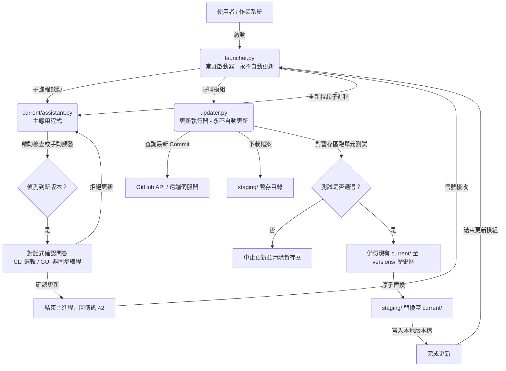

# 輕量級雙重更新與對話式升級架構指南 (Conversational & Safe App Update Architecture)

本指南介紹了一套適用於 Python 應用程式（支援 CLI 與 GUI 介面）的**三層式安全更新與對話式升級架構**。此架構的設計核心為「安全防磚」與「非阻塞式對話體驗」，非常適合需要高穩定度、背景更新檢查、以及整合於對話（Chat）介面中的 AI 助手或桌面應用程式。

---

## 📌 系統架構設計

本架構由三個核心元件組成，各自擁有獨立的工作生命週期：



| 元件名稱 | 存放位置 | 更新機制 | 主要職責 |
| :--- | :--- | :--- | :--- |
| **1. 啟動器 (Launcher)** | `/launcher.py` | 🚫 **永久防刷** | 作為父進程常駐，負責拉起主應用程式、監控結束碼，並在收到 `42` 時觸發更新流程。 |
| **2. 更新器 (Updater)** | `/updater.py` | 🚫 **永久防刷** | 作為更新工具模組，負責連網檢查、靜態下載、在暫存區進行單元測試（防止更新後程式崩潰）、進行備份與檔案替換。 |
| **3. 主程式 (Application)** | `/current/` |  **支援自動更新** | 包含主程式邏輯與 UI，負責在執行期間進行連網版本比對，並以「非阻塞對話」引導使用者確認更新。 |

---

## 🛠️ 核心元件實作細節

### 一、 啟動器工作原理 (Launcher)
啟動器必須是極簡、無外部依賴的程式，負責維持主進程。

* **子進程生命週期監控**：使用 `subprocess` 拉起主程式，並等待其結束。
* **結束碼語意設計**：
  * `0`：正常退出 $\rightarrow$ 結束啟動器。
  * `42` (`EXIT_UPDATE`)：觸發更新 $\rightarrow$ 啟動 `updater.py`。
  * 其他大於 `0` 的值：非預期崩潰 $\rightarrow$ 自動重啟主程式以保證常駐。

#### 範例程式碼 (Python)
```python
import subprocess
import sys
import yaml
from updater import Updater

EXIT_UPDATE = 42

def main():
    while True:
        # 啟動主進程
        proc = subprocess.Popen([sys.executable, "current/assistant.py"] + sys.argv[1:])
        proc.wait()
        
        if proc.returncode == EXIT_UPDATE:
            print("收到更新要求，啟動更新器...")
            # 讀取配置並執行更新
            with open("config.yml", encoding="utf-8") as f:
                config = yaml.safe_load(f)
            
            updater = Updater(config, base_dir=".")
            if updater.run():
                print("更新成功，重新啟動主程式...")
            else:
                print("更新失敗，維持原版本並重啟...")
        elif proc.returncode == 0:
            print("主程式正常結束，關閉啟動器。")
            sys.exit(0)
        else:
            print(f"主程式異常崩潰 (代碼: {proc.returncode})，將在 5 秒後重啟...")
            time.sleep(5)
```

---

### 二、 更新器工作原理 (Updater)
更新器的設計重點在於**防磚 (Brick-proofing)** 與**原子性 (Atomicity)**。

1. **Staging（暫存區）下載**：新程式碼絕不直接覆蓋運行中的 `current/`。必須先下載至獨立的 `staging/` 資料夾。
2. **自動化測試防禦 (`pytest`)**：下載完成後，更新器會在 `staging/` 中執行單元測試。若測試失敗，則立刻中止更新並清除暫存區，保護使用者本地應用程式不被受損的代碼破壞。
3. **歷史備份與原子交換**：
   * 將目前的 `current/` 複製到 `versions/v[舊版本號]/` 備份。
   * 將舊的 `current/` 清除，並以作業系統層級最快的檔案複製或移動方式，將 `staging/` 搬移至 `current/`。
   * 寫入新的 `version.txt`。

---

### 三、 對話式更新與非阻塞機制 (Conversational Updates)
在主程式運行時，為避免傳統彈出式對話框阻斷工作流，應將更新流程融入 Chat UI 中。

#### 1. 關鍵字子字串碰撞防護
在使用對話判定確認時（例如確認「要」或「不要」更新），**必須先檢查否定關鍵字**。
* **原因**：中文的「要」是「不要」的子字串（Substring）。如果先判定「要」，當使用者輸入「不要」時，會因為命中「要」而誤觸發更新。
* **正確判定順序**：
  ```python
  user_input_lower = user_text.lower().strip()
  
  # 1. 先判定否定詞
  if any(w in user_input_lower for w in ["不要", "不", "否", "no", "skip"]):
      awaiting_confirm = False
      return "好的，那我們先不更新。"
      
  # 2. 再判定肯定詞
  elif any(w in user_input_lower for w in ["好", "要", "更新", "yes", "update"]):
      return trigger_update()
  ```

#### 2. GUI 介面中的非同步檢查 (防止凍結)
在 GUI 中（如 PyQt / PySide），連網檢查 GitHub API 是耗時的 I/O 阻塞操作。若直接在 UI 線程中執行會造成程式暫時失去響應（Freeze）。
* **解決方案**：使用 `QThread` 建立一個背景的 `UpdateCheckWorker`。

```python
from PyQt6.QtCore import QThread, pyqtSignal

class UpdateCheckWorker(QThread):
    # 定義信號回傳 (新版本號, 錯誤訊息)
    finished = pyqtSignal(str, str)

    def __init__(self, config, base_dir):
        super().__init__()
        self.config = config
        self.base_dir = base_dir

    def run(self):
        try:
            # 進行耗時的 API 請求與版本比對
            from version_check import check_for_update
            new_tag = check_for_update(self.config, self.base_dir)
            self.finished.emit(new_tag or "", "")
        except Exception as e:
            self.finished.emit("", str(e))
```

* **UI 線程對接**：
  ```python
  def check_update_clicked(self):
      self.title_label.setText("正在檢查更新...")
      self.input_field.setEnabled(False)
      
      self.worker = UpdateCheckWorker(self.config, self.base_dir)
      self.worker.finished.connect(self.on_check_finished)
      self.worker.start()

  def on_check_finished(self, new_version, error):
      self.input_field.setEnabled(True)
      if error:
          self.add_message(f"檢查更新失敗：{error}", is_user=False)
          return
          
      if new_version:
          self.awaiting_update_confirm = True
          self.add_message(f"偵測到新版本 {new_version}。請問現在要更新嗎？", is_user=False)
      else:
          self.add_message("您目前已是最新版本，不需要更新。", is_user=False)
  ```

---

## 🌟 此更新架構的優勢

1. **防磚能力 (Zero-Downtime Design)**：
   * 即使遠端下載的程式碼有缺陷，也會在暫存區的測試階段（pytest）被攔截，絕對不會影響目前可運行的穩定版主程式。
   * Launcher 和 Updater 不會自動更新，避免了「更新程式本身損壞而導致整個 App 再也無法啟動」的致命循環。
2. **對話一致性**：
   * 更新提示不是強制性的彈窗，而是作為一條普通的 AI 訊息呈現在對話紀錄中。
   * 整合了 CLI（終端機）與 GUI（視窗介面），兩者的對話判定邏輯完全一致，非常適合 AI Agent 等文字互動型應用。
3. **平滑的重啟體驗**：
   * 使用者在對話中輸入「好」之後，主程式退出並回傳碼 42，啟動器在 1~3 秒內完成檔案替換，並直接重新拉起新版程式，整個過程對使用者而言僅是短暫的重啟，無需手動重新開啟軟體。
