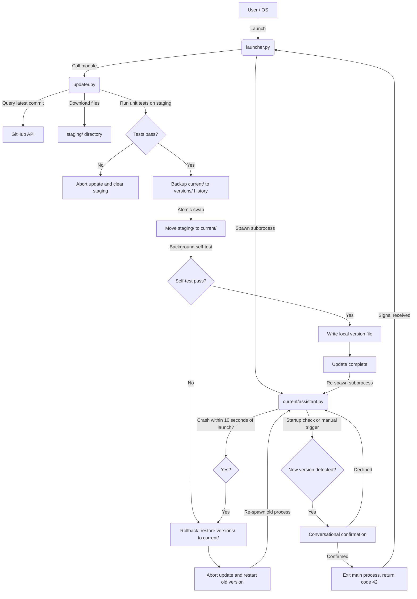

# Conversational & Safe App Update Architecture

This guide describes a **three-tier safe update and conversational upgrade architecture** for Python applications supporting both CLI and GUI interfaces. The core design principles are "brick-proofing" and "non-blocking conversational experience," making it ideal for AI assistants or desktop applications that require high stability, background update checks, and chat-embedded upgrade flows.

---

## 📌 System Architecture

The architecture consists of three core components, each with an independent lifecycle:



| Component | Location | Update Mechanism | Primary Responsibility |
| :--- | :--- | :--- | :--- |
| **1. Launcher** | `/launcher.py` | 🚫 **Never auto-updated** | Persistent parent process; spawns the main application, monitors exit codes, and triggers the update flow on exit code `42`. |
| **2. Updater** | `/updater.py` | 🚫 **Never auto-updated** | Handles version checks, file downloads, runs unit tests in staging, performs backup and file swaps. |
| **3. Application** | `/current/` | ✅ **Supports auto-update** | Contains application logic and UI. Performs version comparison at runtime and guides the user through update confirmation via non-blocking conversation. |

---

## 🛠️ Core Component Implementation Details

### 1. Launcher Operation
The launcher must be minimal with no external dependencies.

* **Subprocess lifecycle monitoring**: Uses `subprocess` to spawn the main application and wait for it to exit.
* **Exit code semantics**:
  * `0`: Normal exit -> Launcher exits.
  * `3` (`EXIT_RESTART`): Intentional restart -> Launcher immediately re-spawns the main application.
  * `42` (`EXIT_UPDATE`): Trigger update -> Launch `updater.py` for download and validation.
  * Any other positive value: Unexpected crash -> Auto-restart main application.

#### Example Code (Python)
```python
import subprocess
import sys
import time
import yaml
from updater import Updater

EXIT_UPDATE = 42
EXIT_RESTART = 3

def main():
    backoff = 1
    just_updated = False
    old_version_for_rollback = None

    while True:
        start_time = time.time()
        proc = subprocess.Popen([sys.executable, "current/assistant.py"] + sys.argv[1:])
        proc.wait()
        elapsed = time.time() - start_time

        if proc.returncode == EXIT_UPDATE:
            backoff = 1
            old_version_for_rollback = Path("version.txt").read_text().strip()
            with open("config.yml", encoding="utf-8") as f:
                config = yaml.safe_load(f)
            updater = Updater(config, base_dir=Path("."))
            if updater.run():
                just_updated = True
            else:
                just_updated = False
        elif proc.returncode == EXIT_RESTART:
            backoff = 1   # intentional restart -- no backoff
            just_updated = False
        elif proc.returncode == 0:
            sys.exit(0)
        else:
            # Unexpected crash
            if just_updated and old_version_for_rollback and elapsed < 10:
                # New version crashed on startup -> rollback
                Updater(config, base_dir=Path(".")).rollback(old_version_for_rollback)
                just_updated = False
                backoff = 1
            else:
                time.sleep(backoff)
                backoff = min(backoff * 2, 60)
                just_updated = False
```

---

### 2. Updater Operation
The updater's design focuses on **brick-proofing** and **atomicity**.

1. **Staging download**: New code is never written directly over the running `current/`. It must first be downloaded into an isolated `staging/` directory.
2. **Automated test defense (`pytest`)**: After download, the updater runs unit tests inside `staging/`. If tests fail, the update is immediately aborted and the staging area is cleared.
3. **Historical backup and atomic swap**:
   * Copy the current `current/` to `versions/v[old_version]/` as a backup.
   * Clear the old `current/` and move `staging/` to `current/`.
   * Write the new `version.txt`.

---

### 3. Conversational Updates & Non-blocking Mechanism

#### 1. Keyword Substring Collision Prevention
When using conversational confirmation, **always check the negation keyword first**.
```python
user_input_lower = user_text.lower().strip()

# 1. Check negations first
if any(w in user_input_lower for w in ["no", "cancel", "skip", "later"]):
    awaiting_confirm = False
    return "OK, skipping the update for now."
    
# 2. Then check affirmatives
elif any(w in user_input_lower for w in ["yes", "ok", "update", "sure"]):
    return trigger_update()
```

#### 2. Asynchronous Check in GUI (Preventing Freeze)
Use `QThread` to run the GitHub API check in the background.

```python
from PyQt6.QtCore import QThread, pyqtSignal

class UpdateCheckWorker(QThread):
    # Signal returns (new_version, error_message)
    finished = pyqtSignal(str, str)

    def __init__(self, config, base_dir):
        super().__init__()
        self.config = config
        self.base_dir = base_dir

    def run(self):
        try:
            from version_check import check_for_update
            new_tag = check_for_update(self.config, self.base_dir)
            self.finished.emit(new_tag or "", "")
        except Exception as e:
            self.finished.emit("", str(e))
```

* **UI thread integration**:
  ```python
  def check_update_clicked(self):
      self.title_label.setText("Checking for updates...")
      self.input_field.setEnabled(False)
      
      self.worker = UpdateCheckWorker(self.config, self.base_dir)
      self.worker.finished.connect(self.on_check_finished)
      self.worker.start()

  def on_check_finished(self, new_version, error):
      self.input_field.setEnabled(True)
      if error:
          self.add_message(f"Update check failed: {error}", is_user=False)
          return
          
      if new_version:
          self.awaiting_update_confirm = True
          self.add_message(f"New version {new_version} detected. Update now?", is_user=False)
      else:
          self.add_message("You are already on the latest version.", is_user=False)
  ```

#### 3. LLM-Driven Conversational Control Markers & Exit/Restart Flow
Ann supports natural language to handle close, restart, and update confirmation via specific control markers:

* **Control marker definitions**:
  * `[EXIT]`: User wants to exit/close the application.
  * `[RESTART]`: User wants to restart the application.
  * `[UPDATE]`: User confirms an update (only injected during the update confirmation prompt).
* **Processing flow**:
  1. **Intent detection**: The system prompt instructs the LLM to append the appropriate marker at the end of a warm farewell message.
  2. **Signal extraction and filtering**: The main application detects the marker and completely removes it from the displayed text.
  3. **Delayed graceful shutdown (GUI only)**:
     - Disable the input field and send button.
     - Update the window title (e.g. "Ann is preparing to restart...").
     - A one-shot $1.5$-second `QTimer` fires after the warm response is displayed, then triggers the system exit.
  4. **Send corresponding exit code**:
     - `[EXIT]` -> exit code `0`.
     - `[RESTART]` -> exit code `3`.
     - `[UPDATE]` -> exit code `42`.

---

### 4. Post-Update Self-Test & Rollback

#### 1. Static Self-Test (`--self-test` flag)
After the updater copies the new code to `/current`, it immediately runs:
```bash
python current/assistant.py --self-test [--cli]
```
* **Logic**: Performs only basic initialization (package imports, config loading) before loading the UI.
* **Outcome**: `exit(0)` on success; `exit(1)` on `ImportError` or config failure.
* **Rollback trigger**: If self-test returns non-zero, `updater.py` restores the previous stable version.

#### 2. Dynamic Startup Monitoring (10-Second Observation Period)
If the application crashes within **10 seconds** of startup after the static test passes, the launcher identifies this as a runtime error in the new version and rolls back to the previous stable version.

---

## 🌟 Advantages of This Update Architecture

1. **Brick-Proof Design (Zero-Downtime)**:
   * Defective remote code is intercepted in the staging test phase (`pytest`) and never affects the running stable version.
   * The Launcher and Updater are never auto-updated, preventing the fatal scenario where the updater itself is broken.
2. **Conversational Consistency**:
   * The update prompt appears as a regular AI message in the conversation history, not a mandatory popup.
   * Integrates both CLI and GUI with identical conversational logic.
3. **Smooth Restart Experience**:
   * After the user confirms in the conversation, the launcher completes the file swap within 1-3 seconds and re-spawns the new version. From the user's perspective, this is just a brief restart.
