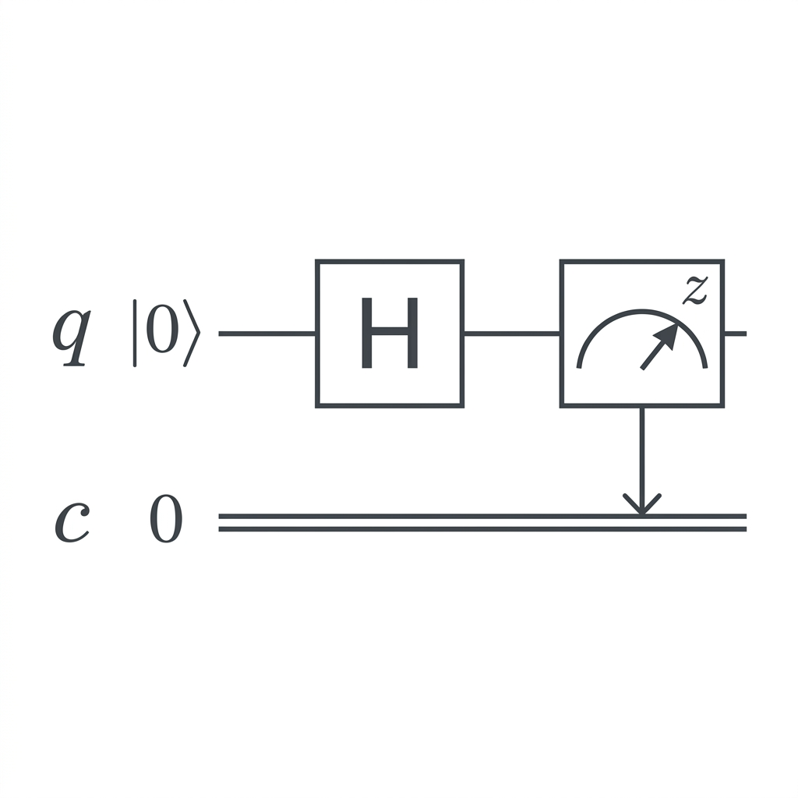

# 量子隨機數生成器（QRNG）專案

## 📌 專案目標
利用量子疊加原理，在傳統電腦上模擬量子隨機數生成器（QRNG）。

---

## 🧠 原理說明

量子位元（qubit）可以同時處於：

|0⟩ 和 |1⟩ 的疊加狀態

當測量時，會隨機塌縮為：

- 0（機率 50%）
- 1（機率 50%）

👉 這就是「真正隨機」的來源

---

## ⚛️ 電路圖（Quantum Circuit）

```
|0⟩ ──[ H ]── Measure ──> 0 / 1
```



### 說明
- H = Hadamard Gate（產生疊加）
- Measure = 測量（產生隨機結果）

---

## 🔧 技術架構

```
Qubit 初始化 → Hadamard → 測量 → 隨機位元輸出
```

---

## 📦 安裝環境

```bash
pip install qiskit
```

---

## 🧪 Python 實作

```python
from qiskit import QuantumCircuit, Aer, execute

def generate_random_bit():
    qc = QuantumCircuit(1, 1)

    qc.h(0)
    qc.measure(0, 0)

    simulator = Aer.get_backend('qasm_simulator')
    result = execute(qc, simulator, shots=1).result()
    counts = result.get_counts()

    return int(list(counts.keys())[0])

for _ in range(10):
    print(generate_random_bit())
```

---

## 🔢 多位元隨機數

```python
def generate_random_number(bits=8):
    number = 0
    for i in range(bits):
        bit = generate_random_bit()
        number |= (bit << i)
    return number

print(generate_random_number(8))
```

---

## 📊 特性

| 項目 | 說明 |
|------|------|
| 隨機性 | 量子機率 |
| 環境 | 模擬器 |
| 擴展性 | 高 |

---

## ⚠️ 限制

- 模擬器 ≠ 真量子硬體
- qubit 數量受限

---

## 🚀 延伸

- 真實量子 API
- NIST entropy 測試
- IoT 整合

---

## 🎯 總結

QRNG 利用量子疊加與測量的不確定性產生隨機數，
可在傳統電腦上透過模擬器實作。
