# System Architecture & Workflow Diagrams

This document illustrates the core execution architecture of the `Local AI Image Generator` project. It features an all-English **Sequence Diagram** demonstrating asynchronous inter-thread UI communication and an **Activity Diagram** detailing the hardware-accelerated PyTorch generation logic.

---

## 1. System Interaction Sequence Diagram

This sequence diagram illustrates the lifecycle of a generation request, starting from the user's UI interaction in `MainWindow`, transitioning to asynchronous execution in `GenerationWorker` (QThread), and detailing how `AIEngine` orchestrates VRAM memory reclamation and decoupled dual-stage image generation on the NVIDIA GPU.

```mermaid
sequenceDiagram
    autonumber
    actor User as User
    participant UI as MainWindow (PySide6 UI)
    participant Worker as GenerationWorker (QThread)
    participant Engine as AIEngine (Backend Manager)
    participant Translator as GoogleTranslator
    participant GPU as Diffusers Pipeline (NVIDIA GPU)
    participant Disk as Local File System (outputs/)

    User->>UI: 1. Input prompt, select model & safety check, click 'Start Generation'
    UI->>UI: 2. Lock UI controls to prevent concurrent clicks
    UI->>Worker: 3. Create & start background worker thread (QThread)
    Worker->>Engine: 4. Call generate(user_prompt, model_key, enable_safety)
    
    rect rgb(24, 24, 36)
        Note over Engine, Translator: Smart Parsing & Auto-Translation Phase
        Engine->>Engine: 5. Regex parse custom resolution (WxH) & image format (png/jpg)
        Engine->>Translator: 6. Check for Chinese characters & request translation
        Translator-->>Engine: 7. Return precise English prompt
    end

    rect rgb(30, 20, 30)
        Note over Engine, GPU: Hardware Scheduling & VRAM Cache Management Phase
        Engine->>Engine: 8. Verify if target model is currently active
        opt Target Model Switched
            Engine->>GPU: 9. Unload active model pipeline (del pipe)
            Engine->>GPU: 10. Execute torch.cuda.empty_cache() to clear VRAM
            Engine->>GPU: 11. Load new model pipeline (AutoPipelineForText2Image)
            Engine->>GPU: 12. Preemptively cast VAE decoder to float32 (prevents black screen)
            Engine->>GPU: 13. Enable Attention Slicing & xformers memory optimization
        end
        Engine->>GPU: 14. Attach or detach safety_checker dynamically based on toggle
    end

    rect rgb(20, 35, 30)
        Note over Engine, GPU: Two-Stage Decoupled Generation Architecture
        Engine->>GPU: 15. Stage 1: Execute UNet denoising loop under torch.autocast('cuda') (16-bit)
        GPU-->>Engine: 16. Return 16-bit latent feature matrix (fp16 Latents)
        Engine->>GPU: 17. Stage 2: Exit autocast, convert Latents & VAE to float32 for clean decoding
        GPU-->>Engine: 18. Return high-fidelity RGB PIL Image
    end

    Engine->>Disk: 19. Save formatted image file to disk (gen_timestamp.format)
    Disk-->>Engine: 20. Return absolute file path
    Engine-->>Worker: 21. Return (filepath, translated_prompt)
    Worker-->>UI: 22. Emit finished signal (QThread inter-thread communication)
    
    UI->>UI: 23. Unlock UI controls & update status bar
    UI->>UI: 24. Load and scale image into QLabel display area
    UI-->>User: 25. Render high-quality generated image
    
    opt User clicks image to inspect original resolution
        User->>UI: 26. Click on image display area
        UI->>Disk: 27. Call os.startfile() to launch system image viewer
        Disk-->>User: 28. Open original high-resolution image in native OS viewer
    end
```

---

## 2. Hardware Execution Activity Diagram

This activity diagram demonstrates the decision-making logic inside `AIEngine.generate()`, emphasizing robust input validation, VRAM garbage collection (`empty_cache`), dynamic safety filtering, and the decoupled precision pipeline (`fp16` UNet / `fp32` VAE).

```mermaid
flowchart TD
    Start(["Start Generation Request"]) --> Mkdir["Ensure outputs/ directory exists"]
    Mkdir --> GetConfig["Resolve model configuration (Steps, Guidance Scale, Default Dimensions)"]
    GetConfig --> ParsePrompt["Regex Parse Prompt: Extract dimensions WxH & format jpg/png"]
    
    ParsePrompt --> TransCheck{"Contains Chinese characters?"}
    TransCheck -- "Yes" --> Translate["Call deep-translator (GoogleTranslator)"]
    Translate --> ValidateTrans{"Valid & non-empty translation?"}
    ValidateTrans -- "Valid" --> PromptOK["Adopt translated English prompt"]
    ValidateTrans -- "Failed/Empty" --> PromptFallback["Fallback: Use original input prompt"]
    TransCheck -- "No" --> PromptOK
    PromptFallback --> PromptOK

    PromptOK --> CheckModel{"Target Model == Active GPU Model?"}
    
    CheckModel -- "Switched" --> DelOld["Unload active model pipeline from VRAM"]
    DelOld --> EmptyCache["Execute torch.cuda.empty_cache() to reclaim memory"]
    EmptyCache --> LoadNew["Load AutoPipelineForText2Image onto GPU"]
    LoadNew --> UpcastVAE["Cast VAE decoder explicitly to float32"]
    UpcastVAE --> OptXformers["Enable Attention Slicing & xformers optimization"]
    OptXformers --> CheckSafety
    
    CheckModel -- "Same" --> CheckSafety{"Is Safety Filter enabled?"}
    
    CheckSafety -- "True" --> EnSafety["pipe.safety_checker = Saved Safety Checker"] --> Stage1
    CheckSafety -- "False" --> DisSafety["pipe.safety_checker = None (Bypass safety check)"] --> Stage1
    
    subgraph DecoupledGeneration ["Two-Stage Decoupled Generation Architecture"]
        Stage1["Stage 1: UNet Denoising Loop under torch.autocast('cuda') (fp16)"] --> RawLatents["Generate 16-bit latent matrix (fp16 Latents)"]
        RawLatents --> CastLatents["Exit autocast, convert Latents to float32"]
        CastLatents --> Stage2["Stage 2: VAE Decoding in pure float32 precision"]
    end
    
    Stage2 --> GetPIL["Acquire high-fidelity RGB PIL Image"]
    GetPIL --> SaveDisk["Save image to disk (gen_YYYYMMDD_HHMMSS.format)"]
    SaveDisk --> End(["Return absolute filepath & English prompt to UI"])
    
    style Start fill:#2e7d32,stroke:#1b5e20,stroke-width:2px,color:#fff
    style End fill:#1565c0,stroke:#0d47a1,stroke-width:2px,color:#fff
    style DecoupledGeneration fill:#1e1e24,stroke:#3d5afe,stroke-width:2px,color:#fff
    style EmptyCache fill:#b71c1c,stroke:#7f0000,stroke-width:2px,color:#fff
    style UpcastVAE fill:#e65100,stroke:#e65100,stroke-width:2px,color:#fff
```

---

## 3. Key Architectural Highlights

1. **Asynchronous Threading Model (`QThread`)**:
   As illustrated in the sequence diagram, `MainWindow` (UI thread) delegates all tensor computations to `GenerationWorker`. This ensures zero UI freeze or "Not Responding" lockups during intensive GPU operations.
2. **VRAM Memory Protection (`empty_cache`)**:
   The activity diagram highlights `torch.cuda.empty_cache()` during model switching. This guarantees long-term stability by preventing CUDA Out-of-Memory (OOM) errors when swapping multi-gigabyte models on 4GB-8GB GPUs.
3. **Dual-Stage Decoupled Generation**:
   By strictly separating Stage 1 (`fp16` UNet under autocast) from Stage 2 (`fp32` VAE outside autocast), the system achieves maximum inference speed without suffering from numerical overflow (black screens) or PyTorch tensor type mismatch errors.
