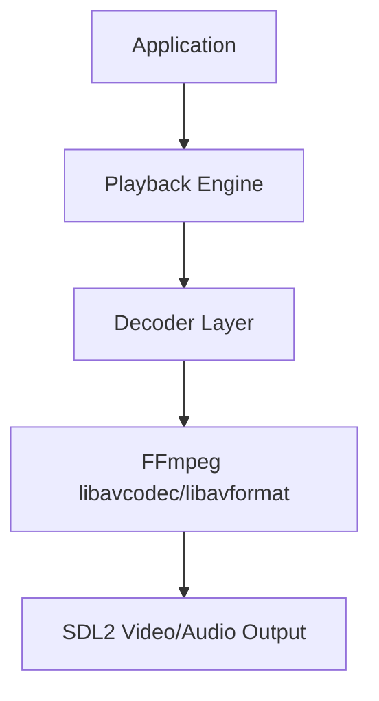
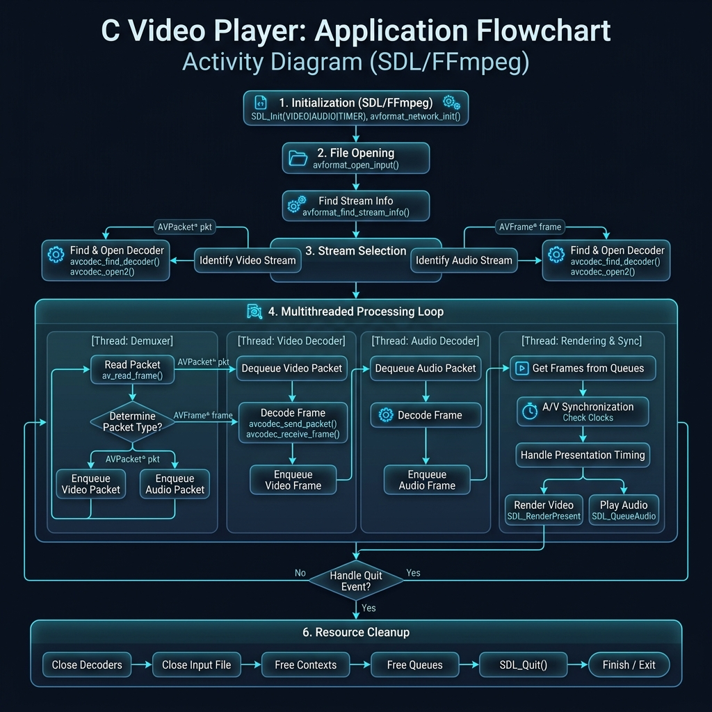
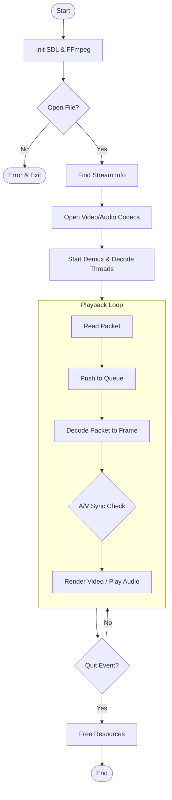
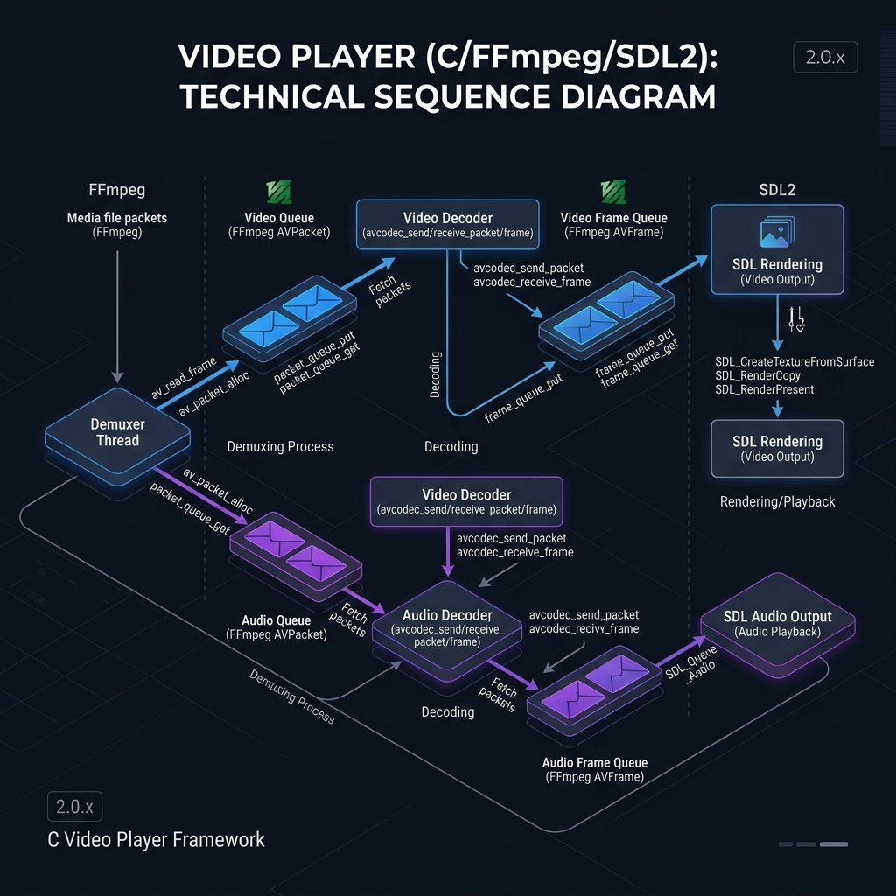
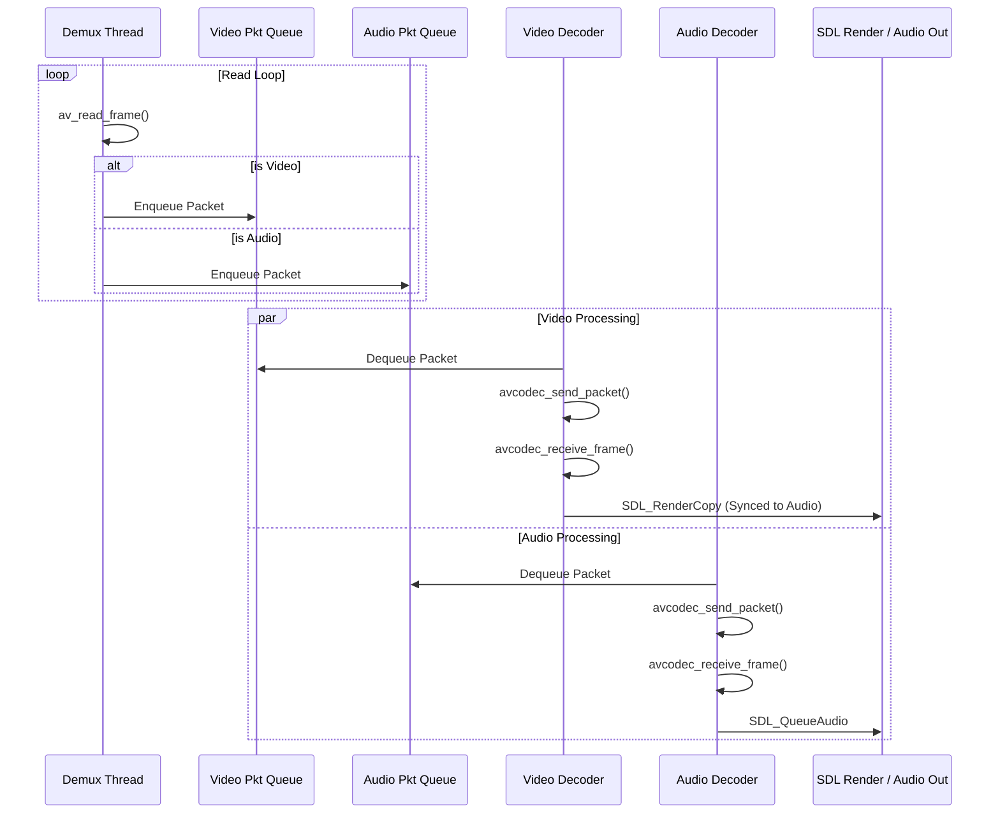

# C + FFmpeg + SDL 影片播放器設計文件

## 1. 專案目標

本專案旨在使用 C 語言，結合 FFmpeg 與 SDL，實作一個可播放影片的跨平台播放器。

系統具備以下能力：
- 支援常見影音格式（MP4 / H.264）
- 影像解碼與顯示
- 音訊播放與同步
- A/V Sync（音畫同步）
- 基本播放控制（play / pause / stop）

---

## 2. 環境配置 (Windows + MinGW-w64)

推薦使用 **MSYS2** 來安裝編譯器與相關核心庫。

### 2.1 安裝指令

在 MSYS2 MINGW64 terminal 執行：
```bash
# 更新系統
pacman -Syu

# 安裝編譯器工具鏈
pacman -S mingw-w64-x86_64-toolchain

# 安裝 FFmpeg 開發庫
pacman -S mingw-w64-x86_64-ffmpeg

# 安裝 SDL2 開發庫
pacman -S mingw-w64-x86_64-SDL2
```

---

## 3. 專案目錄結構

建議的目錄規劃如下：
```text
c_player/
├── bin/            # 編譯產出的執行檔與 DLL
├── include/        # 自定義與第三方標頭檔 (可選)
├── lib/            # 第三方靜態庫 (可選)
├── src/            # 原始碼 (*.c, *.h)
│   ├── main.c
│   ├── decoder.c
│   └── video.c
├── Makefile        # 編譯腳本
└── README.md
```

---

## 4. 技術選型

### FFmpeg
負責：
- demux（解封裝）
- decode（音訊/影像解碼）
- format conversion

核心庫：
- libavformat
- libavcodec
- libswscale
- libswresample

### SDL (Simple DirectMedia Layer)
負責：
- window 管理
- video rendering
- audio playback
- input handling

---

## 5. 系統架構



---

## 6. 核心流程與錯誤處理

在實作時，必須檢查每個 FFmpeg 函數的回傳值：

1. `avformat_open_input`: 開啟檔案 (回傳 < 0 代表失敗)
2. `avformat_find_stream_info`: 取得串流資訊
3. 初始化 Decoder:
   - `avcodec_find_decoder`: 尋找解碼器
   - `avcodec_alloc_context3`: 分配解碼上下文
   - `avcodec_open2`: 開啟解碼器
4. **主迴圈 (Main Loop)**:
   - `av_read_frame`: 讀取 Packet
   - `avcodec_send_packet`: 送入解碼器
   - `avcodec_receive_frame`: 取得解碼後的 Frame
   - 影像處理：`sws_scale` (顏色空間轉換 YUV -> RGB)
   - 音訊處理：`swr_convert` (重採樣)
   - 渲染/播放：SDL_RenderCopy / SDL_QueueAudio

---

## 7. 記憶體管理協議 (Reference Counting)

FFmpeg 使用引用計數管理記憶體，開發者必須遵循以下規則防止洩漏：

### 7.1 AVPacket (壓縮資料)
- **產生**: `av_read_frame` 分配記憶體。
- **釋放**: 處理完後必須呼叫 `av_packet_unref`。
- **注意**: 若將 Packet 放入 Queue，需確保在 Pop 出來並解碼後執行 unref。

### 7.2 AVFrame (原始資料)
- **產生**: `av_frame_alloc` 分配結構，`avcodec_receive_frame` 填充資料。
- **釋放**: 呼叫 `av_frame_unref` 釋放緩衝區資料，或 `av_frame_free` 徹底銷毀結構。

---

## 8. 多執行緒設計

- **Packet Queue**: 存放從 `av_read_frame` 讀取的原始壓縮封包。
- **Frame Queue**: 存放解碼後等待顯示的原始圖像或音訊資料。

同步鎖控：
- 必須使用 `SDL_mutex` 與 `SDL_cond` (或 C11 執行緒庫) 來保護 Queue，避免 Demuxer 與 Decoder 執行緒產生爭搶。

---

## 9. 系統活動圖 (Activity Diagram)





---

## 10. 解碼流程時序 (Sequence Diagram)





---

## 11. A/V Sync 詳細邏輯

### 10.1 同步閾值 (Thresholds)
為避免因微小誤差頻繁調整導致畫面抖動，應設定閾值：
- **AV_SYNC_THRESHOLD_MIN**: 0.04s (低於此值不調整)
- **AV_SYNC_THRESHOLD_MAX**: 0.1s (高於此值則強制跳轉或等待)

### 10.2 補償策略
- **Video 慢了**: 縮短下一幀的等待時間 (delay = delay * 0.5)。
- **Video 快了**: 延長下一幀的等待時間 (delay = delay * 2.0)。
- **嚴重滯後**: 直接丟棄當前 Frame (Drop Frame)，立刻解碼下一幀至同步。

---

## 12. 編譯與連結 (MinGW-w64)

手動編譯指令範例：
```bash
gcc src/main.c -o bin/player.exe \
    -I/mingw64/include \
    -L/mingw64/lib \
    -lavformat -lavcodec -lavutil -lswscale -lswresample \
    -lSDL2 -lSDL2main -mwindows
```

---

## 13. 現狀確認 (環境驗證成功)

> [!NOTE]
> 於 2026-04-16 已透過 `pacman` 完成開發環境安裝，核心函式庫已正確部署於 `C:\msys64\mingw64` 路徑下。

---

## 14. 驗證用範例程式碼 (Quick Test)

您可以將以下內容儲存為 `src/main.c` 後，在 MSYS2 環境下輸入 `make` 進行編譯測試：

```c
#include <stdio.h>
#include <libavcodec/avcodec.h>
#include <SDL2/SDL.h>

int main(int argc, char* argv[]) {
    // 檢查 FFmpeg 版本
    printf("FFmpeg AVCodec Version: %u\n", avcodec_version());
    
    // 檢查 SDL2 初始化
    if (SDL_Init(SDL_INIT_VIDEO | SDL_INIT_AUDIO) != 0) {
        printf("SDL_Init Error: %s\n", SDL_GetError());
        return 1;
    }
    printf("SDL2 Initialized Successfully!\n");
    
    SDL_Quit();
    return 0;
}
```

---

## 15. 執行注意事項 (DLLs)

由於是動態連結，執行時若出現「找不到 DLL」錯誤，請執行以下任一操作：
1. **使用 MSYS2 MINGW64 終端機**：預設已將 `/mingw64/bin` 加入 PATH。
2. **手動複製 DLL**：將 `C:\msys64\mingw64\bin\` 下相關的 DLL 檔案複製到專案的 `bin/` 資料夾下。

---

## 16. 實戰資料結構 (PlayerContext)

```c
typedef struct PacketQueue {
    AVPacketList *first_pkt, *last_pkt;
    int nb_packets;
    int size;
    SDL_mutex *mutex;
    SDL_cond *cond;
} PacketQueue;

typedef struct VideoState {
    AVFormatContext *ic;
    AVStream *video_st;
    AVCodecContext *video_ctx;
    
    PacketQueue videoq;
    struct SwsContext *img_convert_ctx;
    
    SDL_Thread *parse_tid;
    SDL_Thread *video_tid;
    
    double audio_clock;
    double video_clock;
} VideoState;
```

---

## 17. 擴展方向

- subtitle: 支援 SRT / ASS
- hardware decode: 利用 VAAPI / DXVA2 加速
- streaming: 支援 RTSP / HLS 網路串流

---

## 18. 結論

此架構結合了 FFmpeg 的解碼能力與 SDL2 的多媒體輸出能力，是開發跨平台影片播放器的成熟方案。
